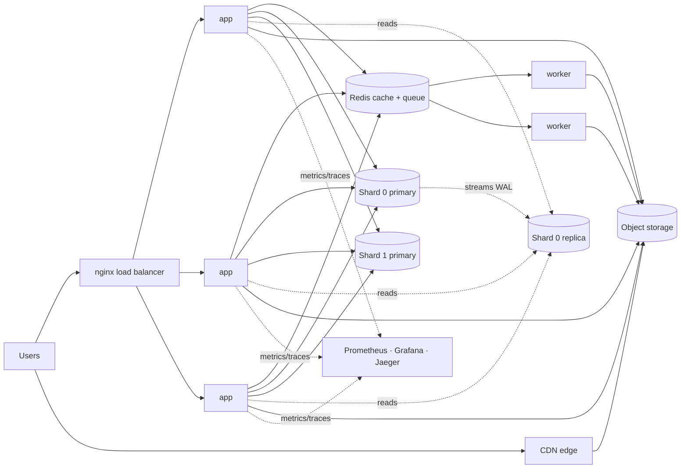

# System Design Evolution

**Load balancer. Cache. Queue. CDN. Replica. Shard.** They're not a checklist. Each one is a fix for something that broke.

This repo starts with **one server and one database**, then adds one component per stage, in the order real systems grow. Every stage is a Docker Compose overlay you can run on a laptop, load-test, and break on purpose.

```
make up STAGE=0   # one box
make load         # watch it struggle
make next         # add the fix for what just broke
```

## The nine stages

| # | What broke | The fix | What it costs you |
|---|---|---|---|
| 0 | Nothing yet | One server, one Postgres | — |
| 1 | One server can't keep up | 3 app replicas + nginx load balancer | Servers must be stateless |
| 2 | Every server hammers the DB | Redis cache | Caches go stale |
| 3 | Reads keep growing | Postgres read replica | Replicas lag |
| 4 | One DB can't hold it all | Shard users by `hash(user_id)` | Cross-shard queries, resharding |
| 5 | Images bloat the DB | Object storage (MinIO, S3-compatible) | Two systems to keep in sync |
| 6 | Far-away users wait | CDN edge cache in front of media | Purging is hard |
| 7 | Uploads block on slow work | Redis queue + background workers | At-least-once delivery → idempotent jobs |
| 8 | Things crash | Restart policies, LB retries, replica failover | More machines, failover you must test |
| 9 | You can't see what's breaking | Prometheus, Grafana, Jaeger, JSON logs | Storage bills, alert fatigue |

Each stage is explained in [`docs/JOURNEY.md`](docs/JOURNEY.md): the symptom, the fix, how to see it working, and the trade-off.

## Where it ends up



## Quick start

Needs Docker with Compose v2.24+ (for `!reset`), and optionally [k6](https://k6.io) for load tests.

```bash
git clone https://github.com/ayimstewart/system-design-evolution.git
cd system-design-evolution
make up STAGE=0

curl -X POST localhost:8000/users/ada/posts -F body="hello world"
curl -X POST localhost:8000/users/ada/posts -F body="a photo" -F image=@some.jpg
curl -i localhost:8000/users/ada/posts        # look at the x-* headers
curl localhost:8000/                          # which components are switched on
```

| Command | What it does |
|---|---|
| `make up STAGE=N` | Run stage N (all overlays 0..N) |
| `make next` | Move up one stage |
| `make load` | 80-second k6 load test, 90% reads / 10% writes |
| `make watch` | Print which app replica answers each request |
| `make chaos TARGET=app` | Crash a container (try `db-replica`, `redis`, `worker`) |
| `make stats` | Rows, image bytes and DB size per shard |
| `make logs` | Tail app and worker logs |
| `make reset` | Delete all data and stop everything |
| `make test` | Run the unit tests (no Docker needed) |

## How to read a response

The API tells you which parts of the system handled each request:

| Header | Meaning | Appears from |
|---|---|---|
| `x-served-by` | Which app container answered | Stage 1 |
| `x-cache` | `HIT`, `MISS`, or `BYPASS` (no cache) | Stage 2 |
| `x-db-role` | `primary` or `replica` | Stage 3 |
| `x-shard` | Which shard holds this user | Stage 4 |
| `X-Cache-Status` (on image URLs) | CDN `HIT` / `MISS` | Stage 6 |

## How it works

There's **one codebase**. Every component is switched on by an environment variable, and each `compose/0N-*.yml` overlay sets one more. Stage 3 adds `REPLICA_URLS`, stage 4 adds `SHARD_URLS`, and so on. The Python code doesn't know which stage it's in; it just uses whatever it's given. See [`app/config.py`](app/config.py).

```
app/            FastAPI service (the same image runs the API and the queue workers)
compose/        00-single-server.yml … 09-observability.yml, one overlay per stage
infra/          nginx, Postgres replication, Prometheus, Grafana configs
loadtest/       k6 script
scripts/        stage runner, chaos and watch helpers
tests/          pytest suite, runs on SQLite + fakeredis
docs/           the stage-by-stage walkthrough
```

### Honest caveats

Laptops are fast and have no network distance, so a few knobs make the bottlenecks visible: `SIMULATED_WORK_MS` (CPU per read), `SIMULATED_QUERY_MS` (how long a query holds a connection), and `PROCESSING_DELAY_SECONDS` (slow image work). Set them to `0` to see raw numbers. The CDN and "multi-region" stages demonstrate the mechanism, not the geography.

## The one question

The skill isn't memorizing these tools. It's asking:

> **What problem forced us to add this?**

Start simple. Find the bottleneck. Add the smallest fix. Repeat.

## License

MIT
